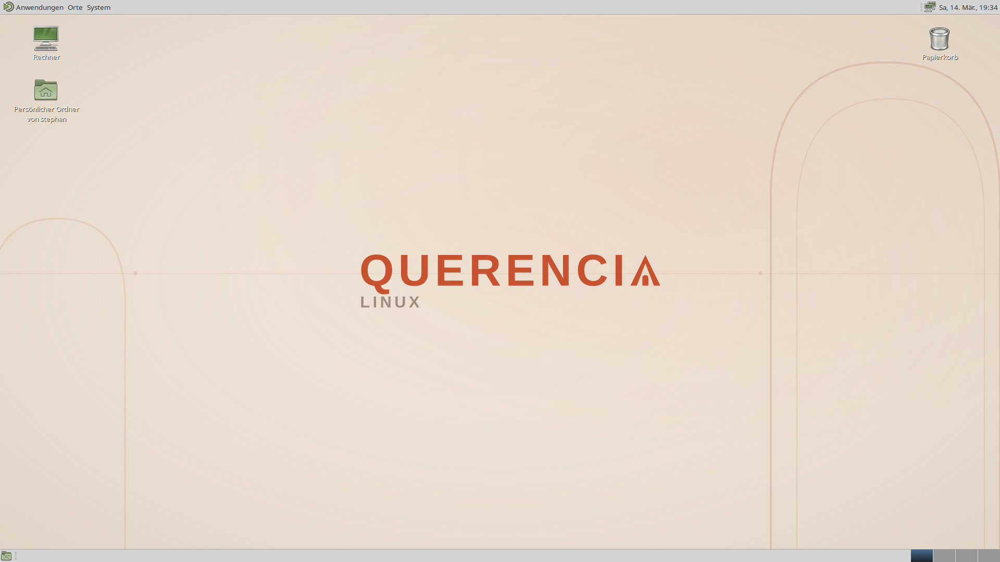

<p align="center">
  
  <br>
  <em>"Where Linux Feels at Home"</em>
  <br><br>
  
  
  
  
  
</p>

A **bootable OCI container image** that works as a complete Linux desktop — atomic, immutable, with automatic rollback. Built on [AlmaLinux 10](https://almalinux.org/) with [MATE Desktop](https://mate-desktop.org/) using the official [AlmaLinux Atomic Respin Template](https://github.com/AlmaLinux/atomic-respin-template).

Available in **two GPU variants** — same repo, same Dockerfile, two images:

| Variant | Image | GPU Stack |
|---|---|---|
| **AMD** (default) | `ghcr.io/endegelaende/querencia-linux:latest` | Mesa + Vulkan (RADV) + VA-API |
| **NVIDIA** | `ghcr.io/endegelaende/querencia-linux-nvidia:latest` | AlmaLinux native `nvidia-open-kmod` (Secure Boot) |

- **AlmaLinux 10** — RHEL-compatible, long-term support
- **MATE Desktop** — classic, lightweight, X11-based
- **bootc** — atomic image-based updates with rollback
- **Micromamba** — user-space package manager, always active (`base` environment)
- **Flatpak** — sandboxed GUI apps from Flathub (Warehouse as app store)
- **Distrobox** — mutable containers for development
- **AMD GPU** — Mesa + Vulkan (RADV) + VA-API, works out of the box
- **NVIDIA GPU** — AlmaLinux native drivers (Secure Boot signed, CUDA included)
- **Multimedia** — full codec support via RPM Fusion

The root filesystem is **read-only**. Install software with Micromamba (CLI tools, languages, libraries), Flatpak (GUI apps), or Distrobox (full dev environments) — no root required.

<p align="center">
  
  <br>
  <em>Yes, it has a taskbar. Yes, it has a start menu. No, we will not apologize.</em>
</p>

---

## Architecture

```
┌─────────────────────────────────────────────────────┐
│                    Your Desktop                      │
│  ┌─────────┐  ┌──────────┐  ┌────────────────────┐  │
│  │ Flatpak │  │Distrobox │  │  Native MATE Apps  │  │
│  │  Apps   │  │Container │  │ (built into image) │  │
│  └─────────┘  └──────────┘  └────────────────────┘  │
├─────────────────────────────────────────────────────┤
│  MATE Desktop + LightDM + PipeWire                   │
├─────────────────────────────────────────────────────┤
│  AMD: Mesa + RADV + VA-API    │  NVIDIA: nvidia-open │
│       + amdgpu driver         │  + switcheroo-control│
├─────────────────────────────────────────────────────┤
│  AlmaLinux 10 bootc (immutable, atomic)              │
├─────────────────────────────────────────────────────┤
│  Linux Kernel + Firmware                             │
└─────────────────────────────────────────────────────┘
```

**Update flow:** GitHub Push/Schedule → GitHub Actions → Build both images (AMD + NVIDIA) → Push to GHCR → `bootc upgrade` on your PC → Reboot (old image kept for rollback)

---

## What's Included

### Desktop & System

| Component | Details |
|---|---|
| MATE Desktop | Full desktop with BlueMenta theme, Noto fonts, Dracula terminal |
| LightDM | GTK greeter, no guest login |
| PipeWire | Audio with PulseAudio compat + WirePlumber + pavucontrol |
| Plymouth | Custom boot splash with Querencia logo |
| ZRAM | Compressed RAM swap (50% of RAM, zstd, auto at boot) |
| Firefox | Pre-installed web browser |
| Redshift | Night mode / blue light filter with auto-geolocation (BeaconDB) |
| fastfetch | Modern system info display (neofetch replacement) |
| `open` alias | macOS-like `open` command (wraps `xdg-open`) |

### Hardware Support

| Component | Details |
|---|---|
| AMD GPU | Mesa + Vulkan (RADV) + VA-API + VDPAU + linux-firmware |
| AMD Legacy GPU | HD 7000 / R7 / R9 series on modern `amdgpu` driver (via modprobe) |
| NVIDIA GPU | AlmaLinux native `nvidia-open-kmod` (Secure Boot signed) + CUDA |
| Hybrid GPU | `switcheroo-control` for Intel/AMD iGPU + NVIDIA dGPU laptops |
| Printing | CUPS (socket-activated) + Gutenprint + Foomatic drivers |
| Scanning | SANE backends for USB/network scanners |
| Bluetooth | BlueZ + Blueman manager |
| WiFi | NetworkManager + WiFi + NM applet |
| VPN | OpenVPN + WireGuard (with NM plugins) |
| iOS Devices | `ifuse` + `libimobiledevice` — mount iPhones/iPads |
| USB-C Docks | Realtek USB Ethernet udev rules (Lenovo, TP-Link, Samsung) |
| Apple SuperDrive | Auto-init udev rule (works when plugged in) |
| Monitors | `ddcutil` — control brightness/settings via DDC/CI |
| Power | `powertop` — power analysis and tuning for laptops |

### Software Management

| Method | Use For | How |
|---|---|---|
| **Flatpak** | GUI apps | Warehouse (app store) or `flatpak install` |
| **Micromamba** | CLI tools, languages | `micromamba install ripgrep python` |
| **Distrobox** | Full dev environments | `ujust distrobox-fedora` |
| **bootc** | System updates | `ujust update` (automatic every 6h) |

### Security & System

| Component | Details |
|---|---|
| Firewall | firewalld (enabled by default) |
| Firewall GUI | firewall-config (GTK frontend for firewalld) |
| SELinux | Enforcing + setroubleshoot (graphical notifications) |
| PolicyKit | mate-polkit agent, wheel group can manage Flatpak |
| Auto-Update | bootc + Flatpak updates every 6 hours (desktop notification) |
| Repo Lockdown | All third-party repos disabled after build + validation gate |
| Build Tests | Automated verification of packages, services, files, GPU config |
| dconf Refresh | Regenerated on every boot (picks up image updates automatically) |
| Locale | 12 language packs (en, de, fr, es, it, pt, nl, pl, ru, ja, zh, ko) |

---

## Installation

### Pull the image

```bash
# AMD (default)
podman pull ghcr.io/endegelaende/querencia-linux:latest

# NVIDIA
podman pull ghcr.io/endegelaende/querencia-linux-nvidia:latest
```

### Rebase from an existing bootc / Atomic system

```bash
# AMD (default)
sudo bootc switch ghcr.io/endegelaende/querencia-linux:latest
sudo reboot

# NVIDIA
sudo bootc switch ghcr.io/endegelaende/querencia-linux-nvidia:latest
sudo reboot
```

### Fresh install with the ISO

1. Download the ISO from [querencialinux.org](https://querencialinux.org) — pick AMD or NVIDIA
2. Write to USB (Ventoy, Rufus, balenaEtcher, or `dd`)
3. Boot from USB → Anaconda installer guides you through:
   - **Language selection** — choose your preferred language
   - **Keyboard layout** — select your keyboard layout (no hardcoded default)
   - **Timezone** — select your timezone
   - **Network** — DHCP is enabled by default
   - **Disk partitioning** — choose your disk (no preset — you decide)
   - **User creation** — set up your user account and password
4. Remove USB & reboot into LightDM

### Test in a VM

```bash
make qcow2
make run-qemu-qcow
```

VM display drivers (QXL, VESA, spice-vdagent) are included.

---

## First Login

On your first login, Querencia automatically:

1. Creates XDG user directories (Documents, Downloads, Pictures, etc.)
2. Sets up Caja bookmarks for quick access
3. Adds Flathub remote for your user
4. Installs **Warehouse** (Flatpak app store) — find it in your application menu
5. Creates a Micromamba `base` environment (ready to use immediately)
6. Opens the **Welcome Center** — a guided introduction to your system (12 languages)

The Welcome Center shows first steps, app installation guides, system info, and helpful links. To stop it appearing at login, uncheck "Show at startup". You can always reopen it from the menu: **System → Welcome to Querencia Linux**.

---

## Updates and Rollback

```bash
ujust update              # full update: bootc + Flatpak
ujust rollback            # roll back to previous image
```

Updates are atomic — the new image is downloaded in the background, staged, and activated on reboot. The previous image is always kept. Auto-updates run every 6 hours.

---

## Installing Software

### GUI Apps (Flatpak)

Open **Warehouse** from your application menu to browse and install apps from Flathub. Or use the terminal:

```bash
flatpak install flathub com.spotify.Client
flatpak install flathub com.valvesoftware.Steam
ujust install-essentials    # recommended apps bundle
```

The `install-essentials` recipe installs: Thunderbird, LibreOffice, Calculator, Evince, Flatseal, Celluloid, Simple Scan. Firefox is already pre-installed.

### CLI Tools & Languages (Micromamba)

The `base` environment is created on first login and always active — install packages right away:

```bash
micromamba install ripgrep bat fd-find    # CLI tools
micromamba install python=3.12 pip       # languages
micromamba install nodejs=22 yarn        # more languages
micromamba search <anything>             # search conda-forge
```

Everything installs into `~/micromamba` — no root, no conflicts with the immutable system.

### Dev Environments (Distrobox)

```bash
ujust distrobox-fedora                # Fedora container with dnf
ujust distrobox-alma                  # AlmaLinux container
ujust distrobox-ubuntu                # Ubuntu container
```

---

## Usage

`ujust` provides shortcuts for common tasks. Run `ujust --list` for all commands.

```bash
ujust update              # update system + Flatpak
ujust status              # show bootc image status
ujust info                # show system info (fastfetch)
ujust mamba-install-tools # install recommended CLI tools (rg, bat, fzf, ...)
ujust install-essentials  # install recommended Flatpak apps
ujust gpu-info            # AMD GPU / Vulkan / VA-API status
ujust distrobox-fedora    # create a Fedora dev container
ujust codec-check         # verify multimedia codecs
ujust maintenance         # full maintenance (update + clean)
```

### All ujust Commands

<details>
<summary><b>System</b></summary>

| Command | Description |
|---|---|
| `ujust update` | Full update (bootc + Flatpak) |
| `ujust update-system` | Update only the bootc base image |
| `ujust update-flatpak` | Update only Flatpak apps |
| `ujust status` | Show bootc image status |
| `ujust rollback` | Roll back to previous image |
| `ujust info` | Show system info (fastfetch) |
| `ujust disk` | Show disk usage |
| `ujust memory` | Show memory usage |
| `ujust services` | Show running services |
| `ujust logs` | Show current boot logs |
| `ujust bios` | Reboot into BIOS/UEFI firmware setup |
| `ujust bios-info` | Show BIOS/UEFI information |
| `ujust trim` | Run SSD TRIM |
| `ujust clean` | Clean up caches and logs |
| `ujust maintenance` | Full maintenance (update + clean) |
| `ujust update-status` | Show auto-update status and log |
| `ujust update-now` | Trigger auto-update manually |
| `ujust update-disable` | Disable automatic updates |
| `ujust update-enable` | Enable automatic updates |
| `ujust device-info` | Collect system diagnostics and upload to pastebin |
</details>

<details>
<summary><b>AMD GPU</b></summary>

| Command | Description |
|---|---|
| `ujust gpu-info` | Show GPU driver, Vulkan, VA-API info |
| `ujust gpu-monitor` | Live GPU monitoring (temp, clock, VRAM) |
| `ujust gpu-sensors` | One-shot sensor readings |
| `ujust gpu-performance` | Set GPU to performance mode |
| `ujust gpu-powersave` | Set GPU to power saving mode |
| `ujust gpu-auto` | Set GPU to automatic mode |
| `ujust gpu-test` | Run Vulkan test (vkcube) |
</details>

<details>
<summary><b>Multimedia</b></summary>

| Command | Description |
|---|---|
| `ujust codec-check` | Check codec status (which formats are supported) |
| `ujust codec-test` | Play a test video (Big Buck Bunny) |
</details>

<details>
<summary><b>Flatpak</b></summary>

| Command | Description |
|---|---|
| `ujust setup-flatpak` | Set up Flathub |
| `ujust install-essentials` | Install recommended apps (Thunderbird, LibreOffice, Flatseal, Simple Scan, etc.) |
| `ujust open-store` | Open Warehouse (Flatpak Store) |
| `ujust clean-flatpak` | Remove unused runtimes |
</details>

<details>
<summary><b>Distrobox</b></summary>

| Command | Description |
|---|---|
| `ujust distrobox-alma` | Create AlmaLinux container |
| `ujust distrobox-fedora` | Create Fedora container |
| `ujust distrobox-ubuntu` | Create Ubuntu container |
| `ujust distrobox-list` | List all containers |
| `ujust distrobox-upgrade` | Upgrade all containers |
</details>

<details>
<summary><b>Third-Party Apps</b></summary>

| Command | Description |
|---|---|
| `ujust install-horizon` | Install Omnissa Horizon Client (VDI) in a Distrobox |
| `ujust remove-horizon` | Remove Horizon Client and its Distrobox |
</details>

<details>
<summary><b>Micromamba</b></summary>

| Command | Description |
|---|---|
| `ujust mamba-setup` | Show micromamba status |
| `ujust mamba-install-tools` | Install CLI tools (ripgrep, bat, eza, fzf, starship, etc.) |
| `ujust mamba-create [name]` | Create empty environment |
| `ujust mamba-install [packages]` | Install packages into base environment |
| `ujust mamba-packages` | List packages in base environment |
| `ujust mamba-list` | List environments |
| `ujust mamba-update` | Update all packages in base environment |
| `ujust mamba-backup [name]` | Export environment to YAML (backup) |
| `ujust mamba-restore [file]` | Restore environment from YAML file |
| `ujust mamba-backups` | Show all backups |
| `ujust mamba-clean` | Clean micromamba cache |
| `ujust mamba-python [version]` | Create a Python development environment |
| `ujust mamba-node [version]` | Create a Node.js development environment |
</details>

<details>
<summary><b>MATE Desktop</b></summary>

| Command | Description |
|---|---|
| `ujust mate-reset-panel` | Reset panel to defaults |
| `ujust mate-dark` | Switch to dark theme (BlueMenta) |
| `ujust mate-light` | Switch to light theme (Menta) |
</details>

<details>
<summary><b>Firewall & Printing</b></summary>

| Command | Description |
|---|---|
| `ujust firewall-status` | Show firewall status |
| `ujust firewall-allow [service]` | Allow a service (e.g. ssh, http) |
| `ujust firewall-block [service]` | Block a service |
| `ujust printer-setup` | Open printer settings |
| `ujust printer-status` | Show CUPS status |
</details>

---

## Build

Requires Podman on Linux. Both GPU variants are built from the same Dockerfile using the `VARIANT` build argument.

| Target | Description |
|---|---|
| `make image` | Build AMD image (default) |
| `make image VARIANT=nvidia` | Build NVIDIA image |
| `make iso` | Build a bootable ISO installer |
| `make qcow2` | Build a QCOW2 VM image |
| `make run-qemu-iso` | Boot ISO in QEMU |
| `make run-qemu-qcow` | Boot QCOW2 in QEMU |
| `make clean` | Remove build output |

CI runs automatically via GitHub Actions (push to `main`, weekly schedule, or manual trigger) using [AlmaLinux atomic-ci](https://github.com/AlmaLinux/atomic-ci). **Both AMD and NVIDIA variants are built in parallel** — a failure in one does not block the other. ISO builds trigger automatically after successful image builds.

---

## Documentation

Full user documentation is available at **[querencialinux.org/docs/](https://querencialinux.org/docs/)** and as Markdown source in [`Documentation/`](Documentation/):

| Guide | Description |
|---|---|
| [Getting Started](Documentation/01-getting-started.md) | First login, Welcome Center, desktop, keyboard, shortcuts |
| [Installing Software](Documentation/02-installing-software.md) | Flatpak, Micromamba, Distrobox |
| [Updates & Maintenance](Documentation/03-updates-and-maintenance.md) | Auto-updates, rollback, ZRAM, system info |
| [Hardware Support](Documentation/04-hardware.md) | GPU (AMD/NVIDIA), printing, scanning, audio, WiFi |
| [FAQ](Documentation/05-faq.md) | 23 frequently asked questions |

---

## Customization

**Add packages** — create a numbered script in `files/scripts/`:

```bash
# files/scripts/47-my-packages.sh
#!/usr/bin/env bash
set -xeuo pipefail
dnf install -y my-package
```

**Add config files** — place them under `files/system/` mirroring the root filesystem:

```
files/system/etc/my.conf  →  /etc/my.conf
```

**Change MATE defaults** — edit `files/system/etc/dconf/db/local.d/01-mate-defaults.conf`.

**Add ujust recipes** — edit `files/system/usr/share/justfiles/custom.just`.

---

## MATE Desktop Defaults

System-wide defaults that users can override individually:

| Setting | Default |
|---|---|
| GTK Theme | BlueMenta |
| Window Manager | Marco (compositing enabled) |
| Fonts | Noto Sans 10, Noto Sans Mono 10 |
| Terminal | Dracula-inspired colors, unlimited scrollback |
| Workspaces | 4 |
| Keyboard Layout | User's choice (set during install) |
| File Manager (Caja) | List view, bookmarks for Documents/Downloads/Pictures/Music/Videos |
| Screensaver | Blank mode, lock after 10 min idle |
| Power (AC) | No sleep, display off after 15 min |
| Power (Battery) | Sleep after 30 min, display off after 5 min, lid = suspend |
| Screenshot | Print = full screen, Alt+Print = window, Shift+Print = area |
| Lock Screen | Super+L |
| Show Desktop | Super+D |
| File Manager | Super+E |
| Night Mode | Redshift available in system tray |

### Audio

**PipeWire** with PulseAudio compatibility and WirePlumber session manager. `pavucontrol` for GUI volume control. Runs as a user service (per-session).

### Display Manager

**LightDM** with **GTK greeter**. Guest login disabled, user switching allowed. Runtime directories created via systemd-tmpfiles (required for bootc where `/var` is recreated on each boot).

---

## Project Structure

```
querencia-linux/
├── .github/
│   ├── actions/config/       ← Shared CI config (registry, platforms, signing)
│   └── workflows/            ← CI: build.yml (images) + build-iso.yml (ISOs)
├── Documentation/            ← User documentation (Markdown source for website docs)
│   ├── 00-index.md           ← Documentation overview
│   ├── 01-getting-started.md ← First login, Welcome Center, desktop, shortcuts
│   ├── 02-installing-software.md ← Flatpak, Micromamba, Distrobox
│   ├── 03-updates-and-maintenance.md ← Auto-updates, rollback, ZRAM, system info
│   ├── 04-hardware.md        ← GPU (AMD/NVIDIA), printing, scanning, audio, WiFi
│   └── 05-faq.md             ← 23 FAQ entries
├── assets/
│   ├── querencia-logo.svg    ← Project logo (used in Plymouth + README)
│   └── querencia{1,2,3}.png  ← Plymouth splash + desktop/login wallpapers
├── copr-fork/                ← COPR fork docs, package inventory, scripts
│   ├── README.md             ← Strategy, package tables, setup instructions
│   ├── packages.json         ← All 128 COPR packages (machine-readable)
│   ├── setup-copr-fork.sh    ← Automated COPR project setup
│   ├── rebuild-all.sh        ← Rebuild all SCM packages (skips deprecated)
│   ├── rebuild-failed.sh     ← Detect and rebuild failed packages in dep order
│   ├── download-srpms.sh     ← Download SRPMs from COPR build results
│   ├── migrate-to-forks.sh   ← Upload→SCM migration (completed)
│   ├── migrate-to-forks-curl.sh ← curl-based migration (Windows)
│   └── forks/                ← Patch docs + specs for GitHub fork repos
├── files/
│   ├── scripts/
│   │   ├── 10-repos.sh       ← EPEL, CRB, Rocky Devel, winonaoctober COPR, RPM Fusion
│   │   ├── 20-mate-desktop.sh ← MATE Desktop + LightDM + Xorg + Fonts + 12 Locales
│   │   ├── 25-audio.sh       ← PipeWire + WirePlumber
│   │   ├── 30-gpu.sh         ← GPU drivers (AMD: Mesa+RADV | NVIDIA: nvidia-open-kmod)
│   │   ├── 35-multimedia.sh  ← GStreamer + FFmpeg codecs (RPM Fusion)
│   │   ├── 40-network.sh     ← NetworkManager, WiFi, OpenVPN, WireGuard, Bluetooth, Firewall
│   │   ├── 45-system-tools.sh ← Firefox, fastfetch, iOS, ddcutil, powertop, Redshift
│   │   ├── 46-printing.sh    ← CUPS + SANE scanner backends
│   │   ├── 50-micromamba.sh   ← Micromamba binary to /usr/bin (pinned + SHA256)
│   │   ├── 55-flatpak.sh     ← Flatpak + Flathub remote + repo init service
│   │   ├── 60-distrobox.sh   ← Distrobox + Podman
│   │   ├── 71-zram.sh        ← ZRAM compressed swap (50% RAM, zstd)
│   │   ├── 72-plymouth.sh    ← Plymouth boot splash + wallpaper install
│   │   ├── 75-post-install.sh ← First-boot service, auto-update, Welcome Center, ujust
│   │   ├── 80-branding.sh    ← os-release, /etc/issue, image-info.json
│   │   ├── 85-gpu-tuning.sh  ← GPU kernel config (AMD: ppfeaturemask | NVIDIA: kargs)
│   │   ├── 87-disable-repos.sh ← Disable third-party repos after install (security)
│   │   ├── 88-validate-repos.sh ← Security gate: fail build if repos still enabled
│   │   ├── 89-tests.sh       ← Build-time tests (packages, services, files, ZRAM, GPU)
│   │   ├── 90-signing.sh     ← Cosign key setup (template — do not modify)
│   │   ├── 91-image-info.sh  ← VARIANT_ID in os-release (template — do not modify)
│   │   ├── build.sh          ← Build orchestrator (template — do not modify)
│   │   └── cleanup.sh        ← Image cleanup (template — do not modify)
│   └── system/               ← Files overlaid onto / during build
│       ├── etc/dconf/        ← MATE defaults (BlueMenta, Noto, Dracula terminal)
│       ├── etc/fonts/        ← Fontconfig (subpixel rendering, Noto fallback)
│       ├── etc/geoclue/      ← BeaconDB WiFi geolocation (privacy-friendly)
│       ├── etc/lightdm/      ← LightDM + GTK greeter config
│       ├── etc/profile.d/    ← Micromamba shell integration + open alias
│       ├── etc/xdg/autostart/ ← Welcome Center autostart (12 languages)
│       ├── etc/yum.repos.d/  ← winonaoctober MATE COPR + Rocky Devel repos
│       ├── usr/bin/           ← querencia-welcome + launcher scripts
│       ├── usr/lib/modprobe.d/ ← AMD legacy GPU support (amd-legacy.conf)
│       ├── usr/lib/querencia/ ← Welcome Center app (Python 3 + GTK 3, 12 languages)
│       ├── usr/lib/systemd/  ← dconf-update.service (regenerate on boot)
│       ├── usr/lib/udev/     ← Realtek USB Ethernet + Apple SuperDrive rules
│       ├── usr/share/applications/ ← Welcome Center menu entry (12 languages)
│       └── usr/share/justfiles/ ← ujust recipes (~50 commands)
├── .gitattributes            ← Enforce LF line endings
├── Dockerfile                ← Multi-stage build (bootc:10, VARIANT arg, DNF cache mount)
├── LICENSE                   ← MIT license
├── Makefile                  ← Local build, ISO, QCOW2, QEMU targets (VARIANT= support)
├── almalinux-bootc.pub       ← Cosign public key (template — do not modify)
├── iso.toml                  ← ISO installer config (interactive Anaconda, no l10n presets)
└── README.md                 ← This file
```

---

## COPR Fork

All MATE Desktop packages come from our own COPR: **[winonaoctober/MateDesktop-EL10](https://copr.fedorainfracloud.org/coprs/winonaoctober/MateDesktop-EL10/)** — an independent MATE Desktop repository for EL10, with no external runtime dependencies.

| Detail | Value |
|---|---|
| **Total packages** | 128 (111 SCM from Fedora distgit, 6 GitHub forks, 11 upload SRPMs) |
| **Auto-rebuild** | 107 packages (pinned to Fedora `f43` branch) |
| **GitHub forks** | 6 packages under [`endegelaende/`](https://github.com/endegelaende) (5 active + 1 deprecated mintmenu) |
| **Deprecated** | 8 packages (dnfdragora + libyui chain + mintmenu — not used in image) |
| **Architectures** | x86_64 + aarch64 |

See [`copr-fork/README.md`](copr-fork/README.md) for full package inventory, branch strategy, and maintenance docs.

---

## FAQ

<details>
<summary><b>Atomic, immutable, bootc, OCI — what?</b></summary>

Your system is a **container image**. Instead of installing packages one by one and hoping nothing breaks, we build the entire OS as a single image — like a Docker container, but bootable. "Atomic" means updates swap the whole image at once (no half-updated Frankenstein systems). "Immutable" means the root filesystem is read-only (no `sudo rm -rf /` accidents). "bootc" is the tool that manages these images. And "OCI" is just the container format — same one Docker and Podman use. In practice: your system updates like a phone, rolls back like a game save, and breaks like… well, it doesn't.
</details>

<details>
<summary><b>Can I still use dnf?</b></summary>

No — the root filesystem is read-only. Use Micromamba for CLI tools and languages (`micromamba install ripgrep python`), Flatpak for GUI apps, or Distrobox for full mutable environments with dnf.
</details>

<details>
<summary><b>What happens if an update breaks?</b></summary>

`ujust rollback` (or `sudo bootc rollback`) switches back to the previous image. You can also pick it from the GRUB boot menu.
</details>

<details>
<summary><b>Does my AMD GPU work?</b></summary>

Any GPU supported by the open-source `amdgpu` driver works out of the box — Mesa, Vulkan (RADV), VA-API hardware decoding are all included.
</details>

<details>
<summary><b>Where do the MATE packages come from?</b></summary>

From our own COPR: [winonaoctober/MateDesktop-EL10](https://copr.fedorainfracloud.org/coprs/winonaoctober/MateDesktop-EL10/) — 128 packages, all under our control. 111 are built directly from Fedora distgit, 6 from our own GitHub forks with minimal EL10 patches (5 active + 1 deprecated), and 11 are stable/frozen upload SRPMs. See [`copr-fork/`](copr-fork/) for details.
</details>

<details>
<summary><b>Can I use Wayland?</b></summary>

Not with MATE — it requires Xorg. LightDM starts an Xorg session.
</details>

<details>
<summary><b>Where is the software store?</b></summary>

**Warehouse** is installed automatically on first login. Find it in your application menu. It shows Flatpak apps from Flathub — the only app source on this immutable system.
</details>

<details>
<summary><b>Why MATE and not GNOME/KDE?</b></summary>

MATE is lightweight, classic, and fast. AlmaLinux already provides official GNOME and KDE atomic images. This project fills the MATE gap.
</details>

<details>
<summary><b>How does this differ from Universal Blue?</b></summary>

| | Querencia Linux | Universal Blue |
|---|---|---|
| Base | AlmaLinux 10 (RHEL-compatible) | Fedora (rolling) |
| Desktop | MATE | GNOME (Bluefin) / KDE (Aurora) |
| Updates | Weekly rebuild | Daily rebuild |
| Philosophy | Enterprise-stable, minimal | Bleeding-edge, feature-rich |
| GPU Focus | AMD (open-source Mesa) | NVIDIA + AMD |
</details>

---

## Acknowledgments

- **[Skip Grube (skip77)](https://copr.fedorainfracloud.org/coprs/skip77/MateDesktop-EL10/)** — Pioneered MATE Desktop packaging for EL10. His COPR was the original (and only) source of MATE packages for AlmaLinux/Rocky 10 and provided the foundation that made this project possible. We built our independent fork on the groundwork he laid.
- **[AlmaLinux](https://almalinux.org/)** — Base image, [Atomic Respin Template](https://github.com/AlmaLinux/atomic-respin-template), and [native NVIDIA support](https://wiki.almalinux.org/documentation/nvidia.html).
- **[MATE Desktop](https://mate-desktop.org/)** — The desktop environment at the heart of Querencia.

## Links

- **Website:** [querencialinux.org](https://querencialinux.org)
- **Documentation:** [querencialinux.org/docs/](https://querencialinux.org/docs/)
- **AMD Image:** `ghcr.io/endegelaende/querencia-linux:latest`
- **NVIDIA Image:** `ghcr.io/endegelaende/querencia-linux-nvidia:latest`
- **COPR:** [winonaoctober/MateDesktop-EL10](https://copr.fedorainfracloud.org/coprs/winonaoctober/MateDesktop-EL10/)

## License

[MIT](LICENSE)